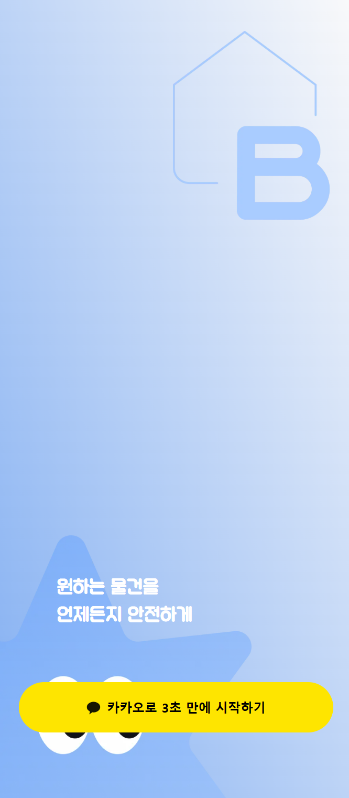
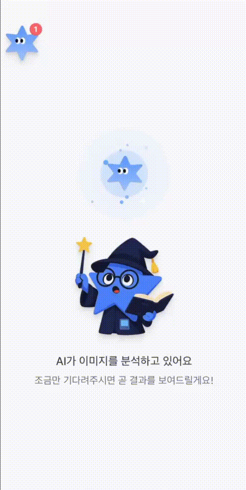
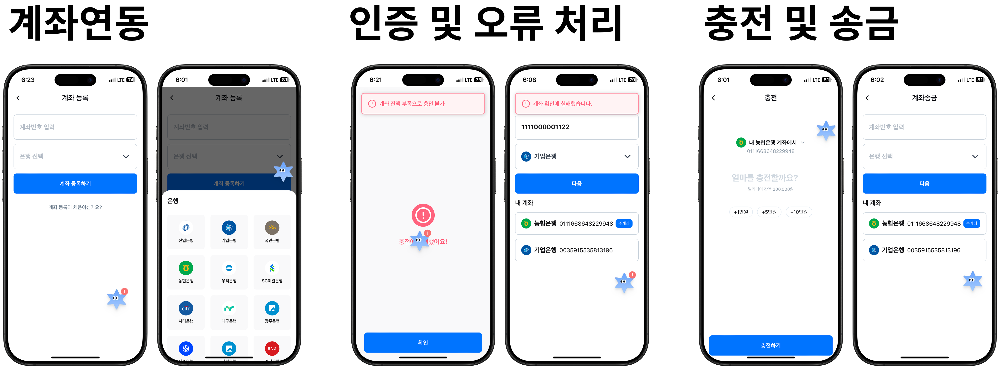
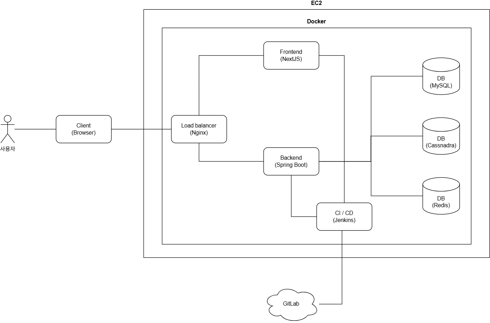
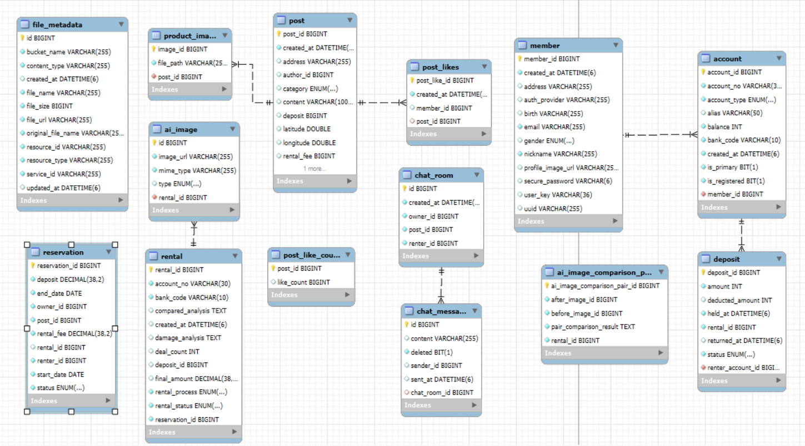

# 🏠 Billie(빌리) - AI 손상도 분석 기반의 C2C 물품 대여 플랫폼

<div>
  
</div>

## 목차

<div>
  <table>
    <tr>
      <td align="center"><a href="#소개">📝 소개</a></td>
      <td align="center"><a href="#데모">🎬 데모</a></td>
      <td align="center"><a href="#기능">✨ 기능</a></td>
    </tr>
    <tr>
      <td align="center"><a href="#설치-및-실행">⚙️ 설치 및 실행</a></td>
      <td align="center"><a href="#기술-스택">🛠️ 기술 스택</a></td>
      <td align="center"><a href="#시스템-아키텍처">🏗️ 시스템 아키텍처</a></td>
    </tr>
    <tr>
      <td align="center"><a href="#프로젝트-구조">📂 프로젝트 구조</a></td>
      <td align="center"><a href="#cicd">⚡ CI/CD</a></td>
      <td align="center"><a href="#erd">💾 ERD</a></td>
    </tr>
    <tr>
      <td align="center"><a href="#팀-멤버-및-역할">👨‍👩‍👧‍👦 팀 멤버 및 역할</a></td>
    </tr>

  </table>
</div>

## 소개

빌리(billy) 는 AI 기반의 손상도 분석을 중심으로 한 C2C 플랫폼입니다. 이미지의 유사도 판별, 대여 전후의 이미지 데이터를 분석하여 손상 여부를 자동 판단하고, 사용자 간의 대여 분쟁을 효과적으로 예방합니다. 본 프로젝트는 신뢰 기반의 대여 생태계 조성을 목표로 하여, 실시간 처리 및 자동화 기능을 통해 사용자의 불편함을 감소시켰습니다.

### 핵심 가치

- 🛡️ **신뢰도 증가**
- 🔎 **분쟁 증거 자동화**
- 🤝 **공유 문화 확산**
- 👫 **사회적 가치**

👉 [프로젝트 링크](http://k12e205.p.ssafy.io/home)
📝 [상세 소개 Notion](https://www.notion.so/D-2-1d5ed04c084080a798b1c19631515596)

## 데모

### 🔎 대여 물품 상태 분석

<div>
  
</div>

### 🔎 안심 반납

<div>
  
</div>

### 📸 AI 게시글 작성

<div>
  
</div>

### 🔔 실시간 위젯

<div>
  
</div>

### 💸 결제 서비스

<div>
  
</div>
<div>
  
</div>

## 기능

### 🔎 AI 물품 상태 비교 분석

- 사진의 유사도 판별 후 매칭
- 매칭된 결과를 바탕으로 손상도 분석
- 손상 결과를 레포트로 제공

### 📸 AI 게시글 작성

- 사용자가 등록한 사진을 AI가 분석하여 제품의 상태를 분석해주고 이에 따라 게시글의 제목, 내용, 카테고리를 작성

### 🔔 실시간 위젯

- 예약/대여에 관한 알림을 실시간으로 수신
- 사용자는 버튼 하나로 해야할 일을 즉각적으로 수행

### 💸 결제 서비스

- 오픈뱅킹 기반의 안정적인 금융 로직 구성
- 직관적인 UI로 구현된 충전/결제 흐름

## 설치 및 실행

### 사전 요구사항

- Node.js 및 npm이 설치되어 있어야 합니다.

### 설치 및 실행 방법

1. 저장소 클론

```bash
git clone https://github.com/your-username/nextdoor.git
cd nextdoor
```

2. 의존성 설치

```bash
npm install
```

3. 실행

```bash
npx run dev
```

## 기술 스택

### 🔙 Backend

<div style="display: flex; gap: 5px;">
  
  
  
  
  
  
  
  
</div>

### 🖥️ Frontend

<div style="display: flex; gap: 5px;">
  
  
  
  
</div>

### 💿 DB

<div style="display: flex; gap: 5px;">
  
  
  
  

</div>

### 🛠️ Development Tools

<div style="display: flex; gap: 5px;">
  
  
  
  
  
</div>

### 🔄 CI/CD

<div style="display: flex; gap: 5px;">
  
  
</div>

### 📊 AI

<div style="display: flex; gap: 5px;">
  
  
</div>

### 🌐 Deployment

<div style="display: flex; gap: 5px;">
  
</div>

### 💠 ETC

<div style="display: flex; gap: 5px;">
  
</div>

## 시스템 아키텍처

<div>
  
</div>

## 프로젝트 구조

<details>
<summary>Backend</summary>

```
com.nextdoor.nextdoor
  ├ command
  ├ common
  ├ config
  ├ domain
  │ ├ aianalysis
  │ │ ├ controller
  │ │ │ └ dto
  │ │ │   ├ request
  │ │ │   └ response
  │ │ ├ enums
  │ │ ├ event
  │ │ │ └ out
  │ │ ├ exception
  │ │ ├ port
  │ │ └ service
  │ │   └ dto
  │ ├ auth
  │ │ ├ controller
  │ │ ├ exception
  │ │ ├ filter
  │ │ ├ port
  │ │ ├ service
  │ │ │ └ out
  │ │ └ util
  │ ├ chat
  │ │ ├ application
  │ │ ├ config
  │ │ ├ controller
  │ │ ├ domain
  │ │ ├ dto
  │ │ ├ infrastructure
  │ │ │ ├ messaging
  │ │ │ ├ persistenct
  │ │ │ └ websocket
  │ │ ├ port
  │ │ ├ service
  │ │ └ websocket
  │ ├ fintech
  │ │ ├ client
  │ │ ├ controller
  │ │ ├ domain
  │ │ ├ dto
  │ │ ├ event
  │ │ ├ port
  │ │ ├ repository
  │ │ └ service
  │ ├ member
  │ │ ├ controller
  │ │ │ └ dto
  │ │ │   ├ request
  │ │ │   └ response
  │ │ ├ domain
  │ │ ├ enums
  │ │ ├ repository
  │ │ └ service
  │ │   └ dto
  │ ├ post
  │ │ ├ controller
  │ │ │ └ dto
  │ │ │   ├ request
  │ │ │   └ response
  │ │ ├ domain
  │ │ ├ event
  │ │ ├ exception
  │ │ ├ listener
  │ │ ├ mapper
  │ │ ├ port
  │ │ ├ repository
  │ │ ├ search
  │ │ ├ service
  │ │ │ └ dto
  │ │ └ strategy
  │ ├ reservation
  │ │ ├ config
  │ │ ├ controller
  │ │ │ └ dto
  │ │ │   ├ request
  │ │ │   └ response
  │ │ ├ domain
  │ │ ├ enums
  │ │ ├ event
  │ │ ├ exception
  │ │ ├ listener
  │ │ ├ port
  │ │ ├ repository
  │ │ ├ service
  │ │ │ └ dto
  │ └ s3store
  │   ├ adapter
  │   ├ config
  │   ├ controller
  │   ├ domain
  │   ├ dto
  │   ├ exception
  │   ├ repository
  │   └ service
  └ query

```

</details>


<details>
<summary>Frontend</summary>

```
nextdoor/
├── app/
│   ├── (auth)/
│   ├── (tabs)/
│   ├── chats/
│   ├── pays/
│   ├── posts/
│   ├── reservations/
│   ├── safe-deal/
│   ├── search/
│   ├── social-login/
│   ├── test/
│   ├── globals.css
│   ├── layout.tsx
│   └── page.tsx
│
├── components/
│   ├── (auth)/
│   ├── (tabs)/
│   ├── chats/
│   ├── common/
│   ├── pays/
│   ├── posts/
│   ├── providers/
│   ├── reservations/
│   ├── safe-deal/
│   ├── search/
│   └── test/
│
├── lib/
│   ├── api/
│   ├── hooks/
│   ├── providers/
│   ├── store/
│   └── utils/
│
├── public/
├── styles/
├── types/
│
├── .env
├── .eslintrc.json
├── .gitignore
├── Dockerfile
├── next.config.mjs
├── package.json
├── postcss.config.mjs
├── tailwind.config.ts
└── tsconfig.json

```

</details>


## CI/CD

- 🔄 Jenkins를 활용해서 지속적 통합 및 배포
- 📋 `develop` 브랜치로 Merge가 완료되면 CI가 동작
- 🚀 이후 자동으로 운영 리소스에 배포

## ERD

<div>
  
</div>

## 팀 멤버 및 역할

|                      허준수                       |                      김경민                       |                      김원찬                       |                      안다정                       |                      임다희                       |                      최재익                       |
| :-----------------------------------------------: | :-----------------------------------------------: | :-----------------------------------------------: | :-----------------------------------------------: | :-----------------------------------------------: | :-----------------------------------------------: |
|                        BE                         |                        FE                         |                      BE & AI                      |                        FE                         |                        FE                         |                        BE                         |
|  |  |  |  |  |  |
